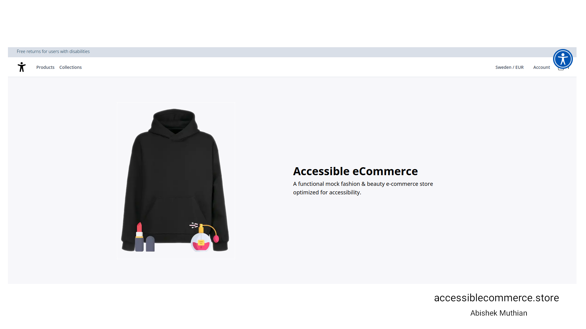

# Accessible eCommerce
A functional mock fashion & beauty e-commerce store optimized for accessibility.

### Demo Video
[](https://youtu.be/Dv-8Igq0CZw)

Clicking the above image will open the video on YouTube.

### Website
[accessiblecommerce.store](https://accessiblecommerce.store)

## Run Accessible eCommerce locally

### Requirements
1. Postgresql with [timescaledb extension](https://docs.timescale.com/install/latest/self-hosted/installation-linux/)
   
2. Node.js

3. Redis

4. Medusa CLI
   ```
   yarn global add @medusajs/medusa-cli
   ```
5. MINIO Object Storage for [Linux](https://min.io/docs/minio/linux/index.html)
6. Gatsby CLI for admin portal and storefront
   ```
   yarn global add gatsby-cli
   ```

### Restore Database
1. Create a database in your postgreSQL instance.

    ```
    $ CREATE DATABASE accessible_ecommerce;
    ```
2. Restore the test database from the db folder to your database.

    ```
    $ cd db
    $ pg_restore -U <username> -h <host> -p <port> -W -F t -d accessible_ecommerce accessible_ecommerce.db
    ```

### Minio Server
If you want to upload files to the eCommerce store via admin.

MinIO server is required for uploading the images to the eCommerce store.

Start the MinIO server & Change the MinIO server port to avoid conflict with the backend port.

    $ minio server ~/minio --console-address :9090 --address :9001

Note: Images for the Accessible eCommerce are pulled automatically from cloud when you use the test database.

### Backend
1. Setup the environment file in the backend folder.
   ```
   $ cd backend
   $ nano .env
   ```

   ```
    JWT_SECRET=
    COOKIE_SECRET=
    STRIPE_API_KEY=
    STRIPE_WEBHOOK_SECRET=
    REDIS_URL=
    DATABASE_URL=
    MINIO_ENDPOINT=
    MINIO_BUCKET=
    MINIO_ACCESS_KEY=
    MINIO_SECRET_KEY=
   ```
 2. Start the backend service
    ```
    $ yarn develop
    ```
 3. Test the backend
    ```
    $ curl localhost:9000/store/products   
    ```
 ### Storefront
1. Setup the environment file the storefront folder.
   ```
   $ cd storefront
   $ nano .env.development
   ```

   ```
   GATSBY_MEDUSA_BACKEND_URL=http://localhost:9000
   GATSBY_STRIPE_KEY=pk_test_something
   ```
2. Start the storefront
   ```
   $ yarn develop
   ```
3. Checkout the storefront at  http://localhost:8000 .

### Admin               
1. Start the admin portal
   ```
   $ cd admin
   $ yarn develop
   ```   
2. Checkout the admin portal at http://localhost:7000 .
3. Use the test credentials `admin@medusa-test.com` and `supersecret` for username and password respectively.

### License
The MIT License (MIT)

Copyright (c) 2023 ABISHEK MUTHIAN (www.accessiblecommerce.store)

Permission is hereby granted, free of charge, to any person obtaining a copy of this software and associated documentation files (the "Software"), to deal in the Software without restriction, including without limitation the rights to use, copy, modify, merge, publish, distribute, sublicense, and/or sell copies of the Software, and to permit persons to whom the Software is furnished to do so, subject to the following conditions:

The above copyright notice and this permission notice shall be included in all copies or substantial portions of the Software.

THE SOFTWARE IS PROVIDED "AS IS", WITHOUT WARRANTY OF ANY KIND, EXPRESS OR IMPLIED, INCLUDING BUT NOT LIMITED TO THE WARRANTIES OF MERCHANTABILITY, FITNESS FOR A PARTICULAR PURPOSE AND NONINFRINGEMENT. IN NO EVENT SHALL THE AUTHORS OR COPYRIGHT HOLDERS BE LIABLE FOR ANY CLAIM, DAMAGES OR OTHER LIABILITY, WHETHER IN AN ACTION OF CONTRACT, TORT OR OTHERWISE, ARISING FROM, OUT OF OR IN CONNECTION WITH THE SOFTWARE OR THE USE OR OTHER DEALINGS IN THE SOFTWARE.

### Licenses for open-source libraries used in this project
Medusa: https://github.com/medusajs under [MIT License](https://github.com/medusajs/medusa/blob/master/LICENSE).

Gatsby: https://github.com/gatsbyjs/gatsby under [MIT License](https://github.com/gatsbyjs/gatsby/blob/master/LICENSE).

### Copyright
Product images are licensed for use in Accessible eCommerce, A demo eCommerce store and Shouldn't be redistributed (or) used in real eCommerce stores.
